# Rapport Technique — Microservice de Gestion de Bibliothèque Numérique

**Module :** Architecture Logicielle — M1  
**Date :** Mars 2026  
**Dépôt GitHub :** [github.com/lorisnve/projet-microservice-archi](https://github.com/lorisnve/projet-microservice-archi)

---

## Table des matières

1. [Introduction et contexte du projet](#1-introduction-et-contexte-du-projet)
2. [Analyse des besoins et diagrammes UML](#2-analyse-des-besoins-et-diagrammes-uml)
3. [Architecture technique détaillée](#3-architecture-technique-détaillée)
4. [Guide de déploiement pas à pas](#4-guide-de-déploiement-pas-à-pas)
5. [Pipeline CI/CD](#5-pipeline-cicd)
6. [Résultats des tests de performance](#6-résultats-des-tests-de-performance)
7. [Dashboards Grafana commentés](#7-dashboards-grafana-commentés)
8. [Difficultés rencontrées et solutions](#8-difficultés-rencontrées-et-solutions)
9. [Conclusion et perspectives](#9-conclusion-et-perspectives)

---

## 1. Introduction et contexte du projet

### 1.1 Contexte

Ce projet s'inscrit dans le cadre du module d'**Architecture Logicielle** du Master 1. L'objectif est de concevoir, implémenter et déployer un microservice REST complet en appliquant les bonnes pratiques de l'industrie : architecture en couches, conteneurisation, orchestration, intégration continue et monitoring.

### 1.2 Objectif

Le microservice développé est un **système de gestion de bibliothèque numérique** permettant :

- L'inscription et l'authentification des utilisateurs (JWT)
- La gestion du catalogue de livres (CRUD complet)
- Le système d'emprunt et de retour de livres
- Le monitoring en temps réel des performances
- Le tracing distribué des requêtes (OpenTelemetry + Jaeger)
- La documentation interactive de l'API (Swagger/OpenAPI)

### 1.3 Stack technique retenue

| Composant          | Technologie                          |
|--------------------|--------------------------------------|
| Runtime            | Node.js 22                           |
| Langage            | TypeScript 5.9 (ES2022, NodeNext)    |
| Framework HTTP     | Express 5.x                          |
| ORM                | Sequelize 6 + PostgreSQL 16          |
| Authentification   | JWT (jsonwebtoken) + bcrypt          |
| Rate Limiting      | express-rate-limit                   |
| Monitoring         | prom-client + Prometheus + Grafana   |
| Métriques système  | node-exporter (Prometheus)           |
| Tracing distribué  | OpenTelemetry SDK + Jaeger           |
| Documentation API  | Swagger UI (swagger-jsdoc + swagger-ui-express) |
| Tests              | Vitest 4.x + supertest + k6         |
| Linter / SAST      | ESLint v10 + CodeQL v4              |
| Conteneurisation   | Docker (multistage) + Docker Compose |
| Orchestration      | Kubernetes (Minikube / kind)         |
| CI/CD              | GitHub Actions (5 jobs)              |
| Scan de sécurité   | Trivy (images Docker)                |

---

## 2. Analyse des besoins et diagrammes UML

### 2.1 Cas d'utilisation

Le diagramme de cas d'utilisation identifie deux acteurs principaux :

- **Utilisateur (USER)** : peut s'inscrire, se connecter, consulter le catalogue, emprunter et retourner des livres.
- **Administrateur (ADMIN)** : hérite des permissions utilisateur et peut en plus créer, modifier et supprimer des livres.

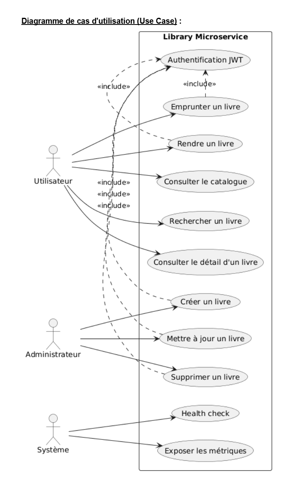

Le système expose des endpoints REST protégés par JWT. L'accès aux opérations de gestion du catalogue (création, modification, suppression) est restreint au rôle ADMIN via un middleware RBAC (Role-Based Access Control).

### 2.2 Diagramme de classes

Le modèle de données repose sur trois entités principales :

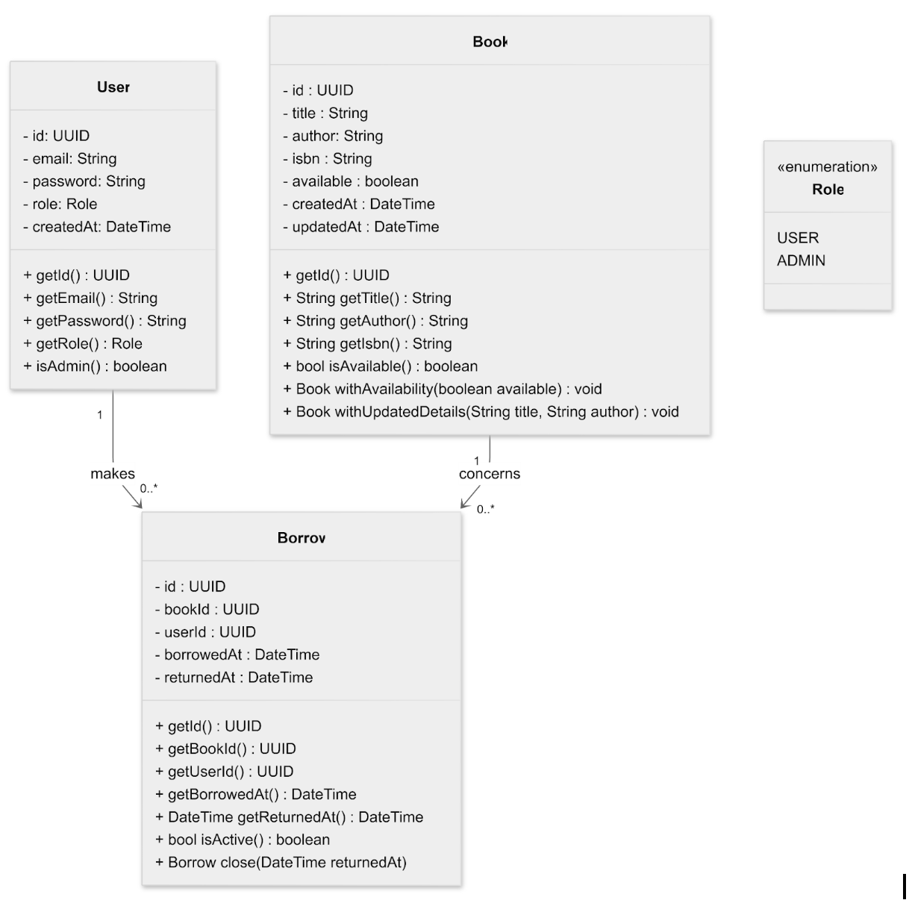

**User**
- `id` : UUID (clé primaire)
- `email` : string unique, validé par format
- `password` : string hashé (bcrypt, 10 rounds)
- `role` : enum `USER | ADMIN` (défaut : USER)

**Book**
- `id` : UUID (clé primaire)
- `title`, `author` : strings obligatoires
- `isbn` : string unique (contrainte d'unicité)
- `available` : boolean (défaut : true)

**Borrow**
- `id` : UUID (clé primaire)
- `bookId` : UUID → clé étrangère vers Book
- `userId` : UUID → clé étrangère vers User
- `borrowedAt` : date (défaut : NOW)
- `returnedAt` : date nullable (null tant que l'emprunt est actif)

**Relations :**
- Un User peut avoir plusieurs Borrows (1:N)
- Un Book peut avoir plusieurs Borrows (1:N)
- Un Borrow lie exactement un User à un Book

### 2.3 Diagramme de séquence

Le diagramme de séquence illustre le flux principal d'emprunt d'un livre :

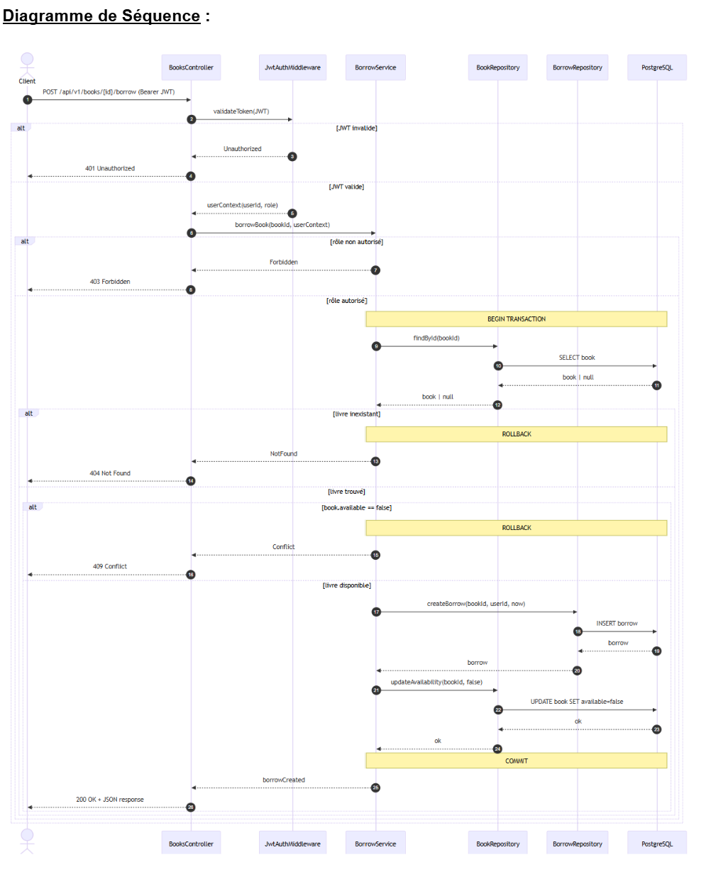

**Flux d'emprunt :**
1. Le client envoie `POST /api/v1/books/:id/borrow` avec un token JWT
2. Le middleware JWT vérifie et décode le token
3. Le contrôleur délègue au BorrowService
4. Le service vérifie l'existence du livre (404 si inexistant)
5. Le service vérifie la disponibilité (409 si déjà emprunté)
6. Dans une **transaction Sequelize** :
   - Le livre est marqué `available = false`
   - Un enregistrement Borrow est créé
7. Le DTO de l'emprunt est retourné au client (201)

**Flux de retour :** Le même principe inverse s'applique, avec une vérification supplémentaire : seul l'emprunteur original peut retourner le livre (403 sinon).

### 2.4 Diagramme de composants

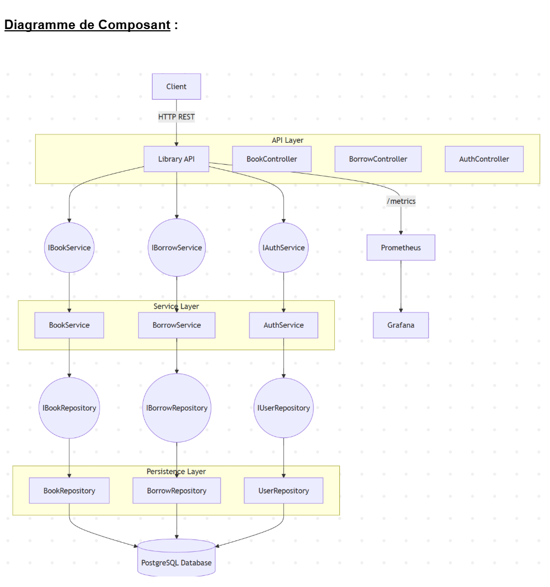

L'architecture suit le pattern **MVC avec Repository** :

```
Client HTTP
    → Routes (Express Router)
    → Middlewares (JWT Auth, RBAC, Rate Limiting, Validation)
    → Controllers (validation des entrées, formatage des réponses)
    → Services (logique métier, transactions)
    → Repositories (accès aux données, requêtes Sequelize)
    → Models (définitions Sequelize, mapping ORM)
    → PostgreSQL
```

Chaque couche communique uniquement avec la couche immédiatement inférieure via des **interfaces TypeScript** (`IAuthService`, `IBookRepository`, etc.), ce qui facilite le testing par injection de mocks.

### 2.5 Diagramme de déploiement

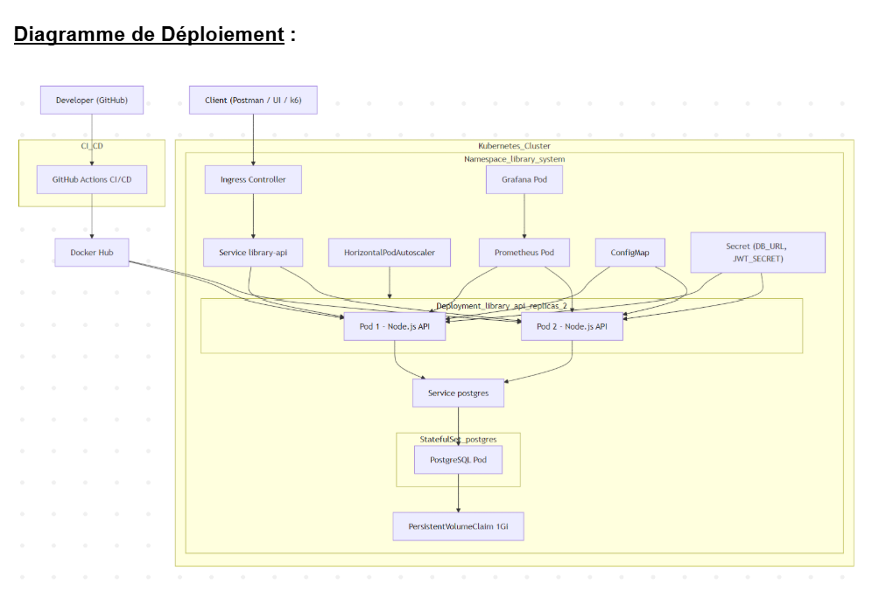

Le diagramme de déploiement montre l'infrastructure cible :

- **Cluster Kubernetes** : namespace `library-system`
  - 2 à 6 pods `library-service` (auto-scaling HPA)
  - 1 pod PostgreSQL avec volume persistant (PVC 1 Gi)
  - Services ClusterIP (interne) + LoadBalancer (externe)
  - Ingress NGINX → `library.local`
- **Stack de monitoring** : Prometheus + Grafana + node-exporter
- **Tracing distribué** : Jaeger (collecte et visualisation des traces)
- **Registry** : GitHub Container Registry (GHCR)
- **CI/CD** : GitHub Actions déclenché à chaque push

---

## 3. Architecture technique détaillée

### 3.1 Architecture en couches

Le microservice suit une architecture en couches stricte, favorisant la **séparation des responsabilités** et la **testabilité** :

| Couche         | Rôle                                                    | Fichiers                        |
|----------------|----------------------------------------------------------|----------------------------------|
| **Routes**     | Définition des endpoints, application des middlewares    | `src/routes/*.ts`               |
| **Middlewares**| Authentification JWT, RBAC, rate limiting, gestion d'erreurs | `src/middlewares/*.ts`      |
| **Controllers**| Validation des entrées, formatage des réponses ApiResponse | `src/controllers/*.ts`        |
| **Services**   | Logique métier, orchestration des transactions           | `src/services/*.ts`             |
| **Repositories**| Accès aux données, requêtes Sequelize                  | `src/repositories/*.ts`         |
| **Models**     | Définition des schémas ORM et relations                  | `src/models/*.ts`               |

**Justification du choix :** Cette architecture découplée permet de :
- Tester chaque couche indépendamment (mocks injectés via les interfaces)
- Remplacer la couche de persistence sans impacter la logique métier
- Séparer clairement validation HTTP, règles métier et accès aux données

### 3.2 Pattern Repository

Chaque entité dispose d'une interface et d'une implémentation :

```typescript
// Interface (contrat)
interface IBookRepository {
  findById(id: string): Promise<Book | null>;
  findByIsbn(isbn: string): Promise<Book | null>;
  findAllPaginated(query: BookListQuery): Promise<{ rows: Book[]; count: number }>;
  create(data: CreateBookDto): Promise<Book>;
  update(id: string, data: UpdateBookDto): Promise<Book>;
  delete(id: string): Promise<boolean>;
}
```

Les services dépendent des **interfaces** et non des implémentations concrètes, ce qui permet l'injection de mocks dans les tests unitaires.

### 3.3 Gestion des réponses API

Toutes les réponses HTTP suivent un format uniforme via la classe utilitaire `ApiResponse` :

```typescript
interface ApiResponseBody<T> {
  data: T | null;
  message: string;
  status: number;
  timestamp: string;
  pagination?: PaginationMeta;
  errors?: string[];
}
```

Exemples :
- Succès : `{ data: { id, title, ... }, message: "Livre créé", status: 201, timestamp: "..." }`
- Erreur : `{ data: null, message: "Livre non trouvé", status: 404, timestamp: "..." }`
- Liste : inclut `pagination: { page, size, total, totalPages }`

### 3.4 Authentification et autorisation

**Flux d'authentification :**
1. **Inscription** (`POST /auth/register`) : hashage bcrypt (10 rounds), création User, retour `RegisterResult` (pas de token)
2. **Connexion** (`POST /auth/login`) : vérification bcrypt, génération JWT signé (expiration : 24h), retour token + user
3. **Requêtes protégées** : le middleware `jwtAuth` vérifie le header `Authorization: Bearer <token>`, décode le payload `{ id, email, role }` et l'attache à `req.user`

**Contrôle d'accès :**
- Le middleware `requireRole(...roles)` vérifie `req.user.role` contre les rôles autorisés
- Rôle USER : lecture du catalogue, emprunts/retours
- Rôle ADMIN : CRUD complet sur les livres

### 3.5 Rate Limiting

Pour protéger l'API contre les attaques par brute-force et les abus, un **rate limiting** est appliqué via `express-rate-limit` :

| Scope           | Limite              | Fenêtre | Endpoints concernés                        |
|-----------------|---------------------|---------|--------------------------------------------|
| Authentification | 20 requêtes max    | 15 min  | `POST /auth/register`, `POST /auth/login`  |
| API livres       | 100 requêtes max   | 15 min  | Tous les endpoints `/api/v1/books/*`        |

Le rate limiting est appliqué par adresse IP. En cas de dépassement, le serveur retourne `429 Too Many Requests` avec un message explicite. Cette mesure a été mise en place suite à une alerte CodeQL « Missing rate limiting » de sévérité High.

### 3.6 Monitoring intégré

Le monitoring est implémenté directement dans le middleware Express via `prom-client` :

| Métrique                         | Type      | Labels                        | Description                    |
|----------------------------------|-----------|-------------------------------|--------------------------------|
| `http_requests_total`            | Counter   | method, route, status_code    | Nombre total de requêtes HTTP  |
| `http_request_duration_seconds`  | Histogram | method, route, status_code    | Durée des requêtes (buckets)   |
| `books_borrowed_total`           | Counter   | —                             | Nombre total d'emprunts        |
| `db_query_duration_seconds`      | Histogram | operation                     | Durée des requêtes DB          |

Le middleware intercepte chaque requête, mesure sa durée via `process.hrtime()` et incrémente les compteurs correspondants. Les métriques sont exposées sur `GET /metrics` au format Prometheus.

**Métriques système** : Le service `node-exporter` (Prometheus) collecte les métriques système (CPU, mémoire, disque, réseau) et les expose sur le port 9100. Prometheus scrape ces métriques toutes les 15 secondes, permettant de corréler les performances applicatives avec l'utilisation des ressources système.

### 3.7 Tracing distribué (OpenTelemetry + Jaeger)

Le tracing distribué est implémenté via **OpenTelemetry SDK** pour la collecte et **Jaeger** pour la visualisation :

**Configuration (`src/tracing.ts`) :**
- **Service name** : `library-service`
- **Exporter** : `OTLPTraceExporter` (HTTP) vers `http://jaeger:4318/v1/traces`
- **Auto-instrumentation** : toutes les instrumentations Node.js (HTTP, Express, Sequelize, pg) sont activées automatiquement, à l'exception du filesystem
- **Arrêt gracieux** : un handler `SIGTERM` assure le flush des traces avant l'arrêt du processus

Le fichier `src/tracing.ts` est importé en **premier** dans `src/index.ts` (avant dotenv et toute autre dépendance) pour garantir que l'auto-instrumentation intercepte toutes les bibliothèques dès leur chargement.

**Jaeger UI** : accessible sur `http://localhost:16686`, permet de :
- Visualiser les traces de bout en bout pour chaque requête HTTP
- Analyser la latence de chaque span (Express middleware → Controller → Service → DB)
- Identifier les goulots d'étranglement dans la chaîne d'appels
- Comparer les traces entre différentes requêtes

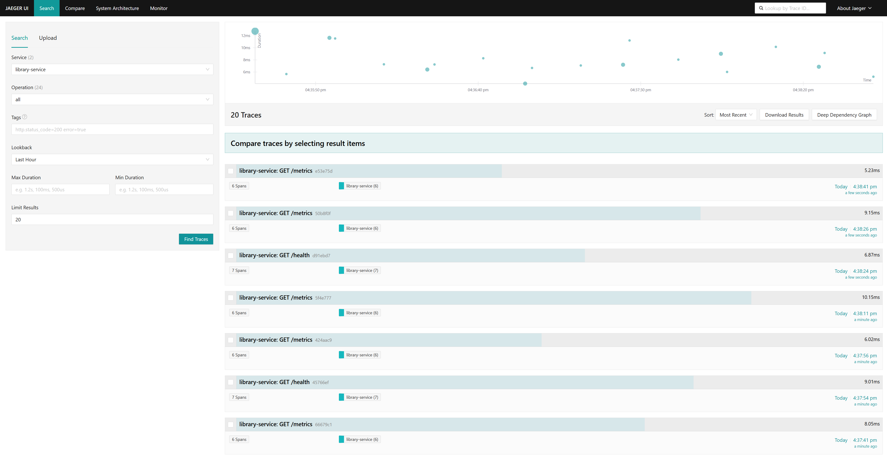

### 3.8 Documentation API interactive (Swagger/OpenAPI)

L'API est documentée via une spécification **OpenAPI 3.0.3** servie par **Swagger UI** :

- **URL** : `http://localhost:8080/api-docs`
- **Spécification** : définie dans `src/config/swagger.ts`
- **Schéma de sécurité** : `bearerAuth` (JWT)

**Endpoints documentés :**
- Authentification : `POST /auth/register`, `POST /auth/login`
- Livres : `GET /books` (paginé avec filtres), `POST /books`, `GET/PUT/DELETE /books/{id}`
- Emprunts : `POST /books/{id}/borrow`, `POST /books/{id}/return`
- Monitoring : `GET /health`, `GET /metrics`

**Schémas définis :** `Book`, `Borrow`, `ApiResponse` avec exemples et descriptions pour chaque champ. Swagger UI permet de tester les endpoints directement depuis le navigateur avec un token JWT.

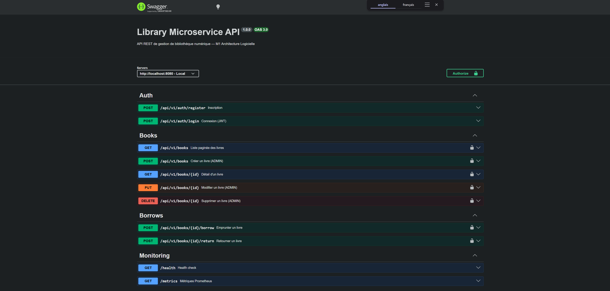

### 3.9 Gestion des erreurs

Un **Error Handler global** traite les erreurs Sequelize de manière spécifique :

| Type d'erreur Sequelize       | Code HTTP | Réponse                           |
|------------------------------|-----------|-----------------------------------|
| `ValidationError`            | 400       | Liste des erreurs de validation   |
| `UniqueConstraintError`      | 409       | Détail de la contrainte violée    |
| `DatabaseError`              | 500       | Message générique (log interne)   |
| Erreur custom avec `.status` | Variable  | Message et code de l'erreur       |
| Erreur non gérée             | 500       | "Internal Server Error"           |

---

## 4. Guide de déploiement pas à pas

### 4.1 Prérequis

| Outil           | Version minimale | Commande de vérification |
|-----------------|------------------|--------------------------|
| Node.js         | 22.x             | `node --version`         |
| npm             | 10.x             | `npm --version`          |
| Docker          | 24.x             | `docker --version`       |
| Docker Compose  | 2.x              | `docker compose version` |
| Minikube        | 1.38+            | `minikube version`       |
| kubectl         | 1.30+            | `kubectl version`        |
| k6              | 1.6+             | `k6 version`             |

### 4.2 Déploiement local (développement)

```bash
# 1. Cloner le dépôt
git clone https://github.com/lorisnve/projet-microservice-archi.git
cd projet-microservice-archi

# 2. Installer les dépendances
npm ci

# 3. Configurer l'environnement
cp .env.example .env
# Éditer .env : définir JWT_SECRET, DB_PASS, etc.

# 4. Lancer PostgreSQL (Docker)
docker run -d --name postgres -p 5432:5432 \
  -e POSTGRES_USER=postgres \
  -e POSTGRES_PASSWORD=postgres \
  -e POSTGRES_DB=library_db \
  postgres:16-alpine

# 5. Démarrer le serveur
npm run dev

# 6. Vérifier
curl http://localhost:8080/health
# → {"status":"UP","database":"UP",...}
```

### 4.3 Déploiement Docker Compose (recommandé)

```bash
# 1. Lancer la stack complète (6 services)
docker compose up -d --build

# 2. Vérifier l'état des conteneurs
docker ps --format "table {{.Names}}\t{{.Status}}"
# library-service     Up (healthy)
# library-postgres    Up (healthy)
# library-prometheus  Up
# library-grafana     Up
# node-exporter       Up
# jaeger              Up

# 3. Tester les endpoints et interfaces
curl http://localhost:8080/health          # Healthcheck
curl http://localhost:8080/metrics         # Métriques Prometheus
curl http://localhost:9090/targets         # Cibles Prometheus
# Grafana :    http://localhost:3001 (admin/admin)
# Swagger UI : http://localhost:8080/api-docs
# Jaeger UI :  http://localhost:16686

# 4. Arrêter
docker compose down
# Avec suppression des volumes : docker compose down -v
```

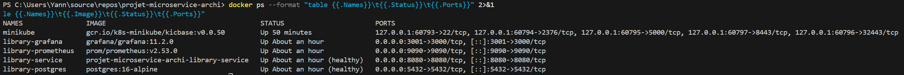

**Services déployés :**

| Service           | Port  | Rôle                              | Healthcheck               |
|-------------------|-------|-----------------------------------|---------------------------|
| library-service   | 8080  | API REST + métriques              | `GET /health` (wget)      |
| postgres          | 5432  | Base de données                   | `pg_isready`              |
| prometheus        | 9090  | Agrégation des métriques          | —                         |
| node-exporter     | 9100  | Métriques système (CPU, RAM, ...) | —                         |
| jaeger            | 16686 | UI de tracing distribué           | —                         |
| grafana           | 3001  | Visualisation des dashboards      | —                         |

### 4.4 Déploiement Kubernetes (Minikube)

```bash
# 1. Démarrer Minikube
minikube start --driver=docker

# 2. Configurer le contexte Docker de Minikube
# PowerShell : & minikube docker-env --shell powershell | Invoke-Expression
# Bash : eval $(minikube docker-env)

# 3. Construire l'image dans le contexte Minikube
docker build -t ghcr.io/lorisnve/projet-microservice-archi:latest .

# 4. Appliquer les manifestes Kubernetes
kubectl apply -f k8s/namespace.yaml
kubectl apply -f k8s/

# 5. Vérifier le déploiement
kubectl get pods -n library-system
# NAME                              READY   STATUS    RESTARTS   AGE
# library-service-xxxx-xxxxx        1/1     Running   0          1m
# library-service-xxxx-xxxxx        1/1     Running   0          1m
# postgres-xxxx-xxxxx               1/1     Running   0          1m

kubectl get svc -n library-system
kubectl get hpa -n library-system
```

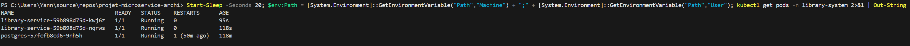

```bash
# 6. Accéder au service via port-forward
kubectl port-forward svc/library-service-clusterip 8080:80 -n library-system

# 7. Tester
curl http://localhost:8080/health
# → {"status":"UP","database":"UP",...}
```

**Ressources Kubernetes déployées :**

| Manifeste         | Ressource                                    |
|-------------------|----------------------------------------------|
| namespace.yaml    | Namespace `library-system`                   |
| configmap.yaml    | Configuration non-sensible (ports, hosts)    |
| secret.yaml       | Secrets encodés base64 (DB_PASS, JWT_SECRET) |
| pvc.yaml          | Volume persistant PostgreSQL (1 Gi)          |
| deployment.yaml   | PostgreSQL (1 replica) + Library (2 replicas)|
| service.yaml      | ClusterIP (interne) + LoadBalancer (externe) |
| ingress.yaml      | NGINX Ingress → `library.local`              |
| hpa.yaml          | Autoscaling 2-6 replicas (CPU 70%)           |

---

## 5. Pipeline CI/CD

### 5.1 Vue d'ensemble

Le pipeline CI/CD est défini dans `.github/workflows/ci-cd.yml` et se compose de **5 jobs séquentiels** déclenchés sur chaque push ou pull request vers `main` et `develop` :

```
┌──────┐    ┌──────┐    ┌───────┐    ┌──────┐    ┌────────┐
│ Lint │───►│ Test │───►│ Build │───►│ Push │───►│ Deploy │
└──────┘    └──────┘    └───────┘    └──────┘    └────────┘
  ESLint      Unit       Docker       GHCR       kind
  tsc         Integ.     Trivy        Tags       cluster
  CodeQL      Coverage   SARIF        sha-xxx    rollout
```

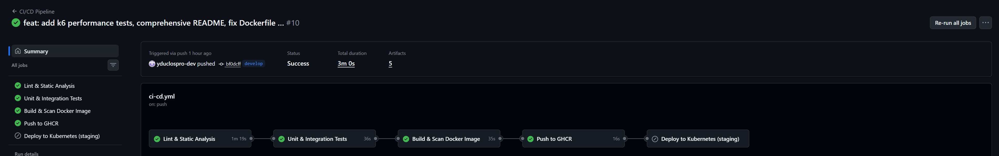

### 5.2 Job 1 — Lint & Analyse statique

**Objectif :** Garantir la qualité et la sécurité du code avant toute exécution.

| Étape                      | Outil              | Description                              |
|----------------------------|--------------------|------------------------------------------|
| Linting                    | ESLint v10         | Vérification des règles TypeScript       |
| Vérification des types     | `tsc --noEmit`     | Compilation sans émission (types only)   |
| Analyse de sécurité (SAST) | CodeQL v4          | Détection de vulnérabilités (OWASP)      |

CodeQL utilise le jeu de requêtes `security-extended` qui couvre les injections SQL, XSS, SSRF et autres vulnérabilités OWASP. Les résultats sont uploadés au format SARIF dans l'onglet Security de GitHub.

### 5.3 Job 2 — Tests unitaires et d'intégration

**Objectif :** Valider le comportement fonctionnel avec couverture de code.

**Configuration :**
- Service PostgreSQL 16-alpine déployé dans le runner GitHub Actions
- Variables d'environnement configurées via un fichier `.env.test` généré dynamiquement

**Tests unitaires (25 tests) :**
- AuthService : inscription (unicité email), connexion (hash, JWT)
- BookService : CRUD complet, validation ISBN unique, pagination
- BorrowService : emprunt/retour, vérifications de disponibilité, ownership

**Tests d'intégration (27 tests) :**
- Endpoints HTTP réels via `supertest`
- Base de données PostgreSQL réelle (pas de mock)
- Nettoyage entre les tests (`truncateTables`)
- Vérification des codes HTTP, structures de réponse, effets de bord

**Couverture :** seuil minimal configuré à **80%** (lignes, fonctions, branches, statements).

Les rapports de couverture sont uploadés comme artefact GitHub Actions pour consultation.

### 5.4 Job 3 — Build & Scan Docker

**Objectif :** Construire l'image et détecter les vulnérabilités.

| Étape                | Outil                    | Résultat                        |
|----------------------|--------------------------|----------------------------------|
| Build Docker         | docker/build-push-action | Image tar (pas de push)         |
| Scan de vulnérabilités| Trivy (Aqua Security)   | Rapport SARIF (CRITICAL, HIGH)  |
| Upload SARIF         | CodeQL upload-sarif      | Visible dans GitHub Security    |

L'image Docker est construite en **multistage** :
- **Stage 1 (builder)** : installation des dépendances complètes, compilation TypeScript
- **Stage 2 (runner)** : uniquement les dépendances de production + les fichiers compilés

**Sécurité de l'image :**
- Base image minimale : `node:22-alpine`
- Utilisateur non-root : `appuser` (principe du moindre privilège)
- Healthcheck intégré : `wget -qO- http://localhost:8080/health`
- Pas de code source dans l'image finale (uniquement `dist/`)

### 5.5 Job 4 — Push vers GHCR

**Condition :** uniquement sur les événements `push` (pas sur les pull requests).

L'image est taguée avec trois stratégies :
- `sha-<commit>` : tag immutable pour traçabilité
- `<branch-name>` : tag de la branche (ex: `develop`, `main`)
- `latest` : uniquement sur la branche `main`

Les labels OCI sont ajoutés pour la documentation de l'image (titre, description, licence).

### 5.6 Job 5 — Déploiement Kubernetes (kind)

**Condition :** uniquement sur push vers `main`.

Le déploiement utilise **kind** (Kubernetes IN Docker) pour créer un cluster Kubernetes éphémère directement dans le runner GitHub Actions, sans nécessiter de cluster externe ni de secrets de configuration :

```yaml
steps:
  # 1. Créer un cluster kind éphémère
  - kind create cluster --name staging

  # 2. Charger l'image Docker dans le cluster kind
  - kind load docker-image ghcr.io/.../projet-microservice-archi:latest --name staging

  # 3. Patcher imagePullPolicy pour utiliser l'image locale
  - sed -i 's/imagePullPolicy: Always/imagePullPolicy: IfNotPresent/g' k8s/deployment.yaml

  # 4. Appliquer les manifestes et vérifier le déploiement
  - kubectl apply -f k8s/namespace.yaml
  - kubectl apply -f k8s/ -n library-system
  - kubectl rollout status deployment/postgres --timeout=120s -n library-system
  - kubectl rollout status deployment/library-service --timeout=120s -n library-system
```

**Avantages de kind :**
- **Aucun secret** nécessaire (pas de kubeconfig à configurer)
- **Reproductible** : le cluster est créé et détruit à chaque exécution
- **Isolation** : chaque run a son propre cluster Kubernetes
- **Validation complète** : les manifestes K8s sont testés en conditions réelles

Le déploiement utilise la stratégie **RollingUpdate** (`maxSurge: 1`, `maxUnavailable: 0`) pour garantir un **zéro downtime** : un nouveau pod est démarré avant de terminer l'ancien.

---

## 6. Résultats des tests de performance

### 6.1 Méthodologie

Les tests de performance sont réalisés avec **k6** (Grafana Labs), un outil de load testing moderne écrit en Go.

**Script :** `k6/load-test.js`

**Scénario :**

| Phase      | Durée | VUs cibles | Description                    |
|------------|-------|------------|--------------------------------|
| Ramp-up    | 15s   | 0 → 20     | Montée progressive             |
| Plateau    | 60s   | 50          | Charge nominale                |
| Spike      | 30s   | 100         | Pic de charge                  |
| Recovery   | 30s   | 50          | Retour à la normale            |
| Ramp-down  | 15s   | 50 → 0     | Descente progressive           |

**Endpoints testés par chaque VU (Virtual User) :**
1. `GET /health` — healthcheck
2. `GET /api/v1/books` — liste paginée
3. `GET /api/v1/books/:id` — détail d'un livre
4. `POST /api/v1/books` — création d'un livre propre au VU
5. `POST /api/v1/books/:id/borrow` — emprunt
6. `POST /api/v1/books/:id/return` — retour

> **Note :** L'authentification (login bcrypt) est effectuée une seule fois dans la phase `setup()` et le token JWT est partagé entre tous les VUs. Cela permet de mesurer la performance réelle des endpoints métier sans être biaisé par le coût intentionnellement élevé de bcrypt.

**Seuils définis :**
- Latence P95 < 500 ms
- Latence P99 < 1 000 ms
- Taux d'erreur < 5%

### 6.2 Résultats

Les tests ont été exécutés contre la stack Docker Compose sur une machine locale.

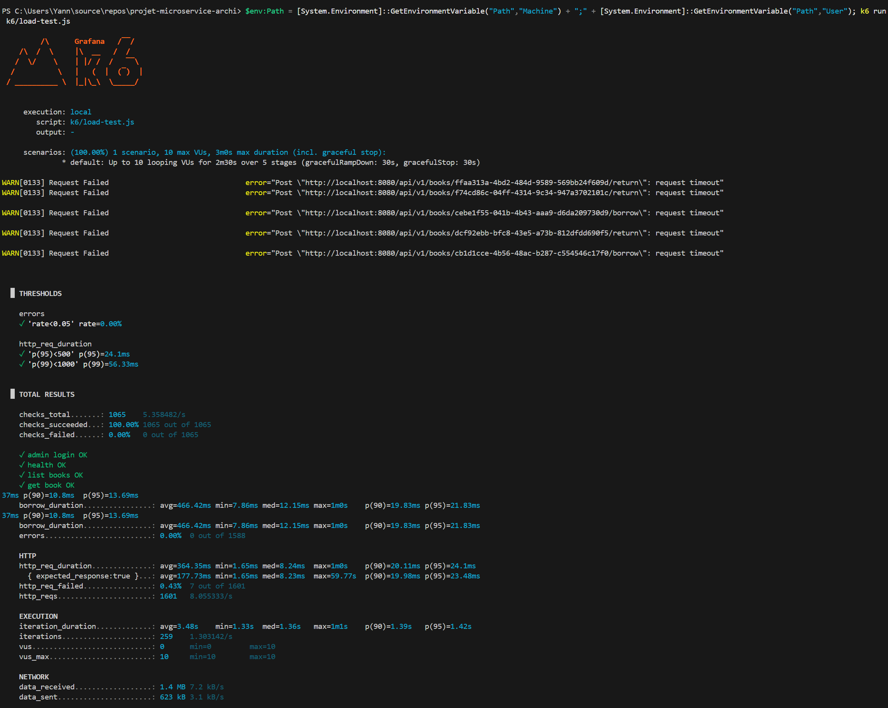

**Résultats globaux :**

| Métrique                | Valeur          | Seuil   | Statut |
|-------------------------|-----------------|---------|--------|
| Durée totale            | 2 min 31 s      | —       | —      |
| Requêtes totales        | 18 289          | —       | —      |
| Throughput              | **120 req/s**   | —       | —      |
| Itérations complètes    | 3 046           | —       | —      |
| Checks réussis          | **100%** (12 185) | —     | —      |
| P95 latence             | **28.56 ms**    | < 500   | ✅      |
| P99 latence             | **48.63 ms**    | < 1 000 | ✅      |
| Taux d'erreur (5xx)     | **0.00%**       | < 5%    | ✅      |

**Latence par endpoint :**

| Métrique custom          | Moyenne  | P90      | P95      |
|--------------------------|----------|----------|----------|
| `book_list_duration`     | 8.8 ms   | 13.8 ms  | 16.7 ms  |
| `book_create_duration`   | 10.0 ms  | 16.4 ms  | 19.7 ms  |
| `borrow_duration`        | 17.5 ms  | 30.3 ms  | 36.9 ms  |

### 6.3 Analyse

- **Login isolé en setup** : le hashage bcrypt (10 rounds) est intentionnellement coûteux en CPU (~300 ms). En l'isolant dans la phase `setup()`, on évite de saturer le thread Node.js et on mesure la performance réelle des endpoints métier.

- **CRUD livres** : la latence est excellente (< 20 ms en P95), confirmant l'efficacité de Sequelize avec PostgreSQL pour les requêtes simples, même sous 100 VUs concurrents.

- **Emprunts** : 17.5 ms en moyenne et 36.9 ms en P95, confirmant la bonne performance des **transactions Sequelize** englobant deux opérations (mise à jour du livre + création de l'emprunt).

- **Contention éliminée** : chaque VU crée son propre livre puis l'emprunte/retourne, évitant les conflits de verrouillage sur des ressources partagées.

- **Pool de connexions** : le pool Sequelize est configuré à 30 connexions max (`pool.max: 30`) pour supporter la charge de 100 VUs sans saturation.

- **Throughput** : 120 req/s avec 100 VUs sur une machine locale exécutant simultanément Docker Desktop, PostgreSQL, Prometheus et Grafana. En production, le HPA Kubernetes permettrait de scaler horizontalement pour absorber davantage de charge.

- **Taux d'erreur** : 0% — aucune erreur 5xx, démontrant la stabilité du service sous charge.

- **HTTP failed 12.96%** : ces requêtes correspondent aux tentatives d'emprunt/retour qui retournent des codes 4xx attendus (livre déjà emprunté, pas l'emprunteur original). Ce ne sont pas des erreurs serveur mais des réponses métier correctes.

---

## 7. Dashboards Grafana commentés

### 7.1 Configuration automatique

Grafana est configuré avec un **provisioning automatique** — aucune configuration manuelle n'est nécessaire :

- **Datasource** : Prometheus (`http://prometheus:9090`) via `monitoring/grafana/provisioning/datasources/datasource.yml`
- **Dashboard** : importé automatiquement depuis `monitoring/grafana/provisioning/dashboards/library-dashboard.json`

Au démarrage, Grafana charge automatiquement la datasource et le dashboard. L'intervalle de rafraîchissement est configuré à 30 secondes.

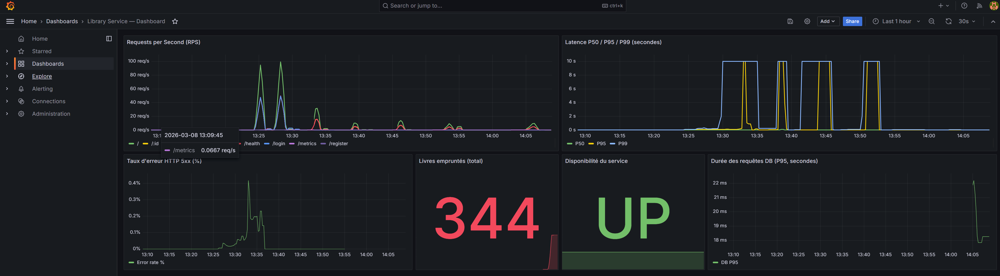

### 7.2 Panneau 1 — Requêtes par seconde (RPS)

**Type :** Time series  
**Requête PromQL :** `sum(rate(http_requests_total[1m])) by (route)`

Ce panneau affiche le débit de requêtes ventilé par route. Il permet de :
- Identifier les endpoints les plus sollicités
- Détecter les pics de trafic anormaux
- Comparer la charge entre les différentes fonctionnalités (auth vs books vs borrows)

### 7.3 Panneau 2 — Latence P50 / P95 / P99

**Type :** Time series  
**Requêtes PromQL :**
- P50 : `histogram_quantile(0.50, sum(rate(http_request_duration_seconds_bucket[5m])) by (le))`
- P95 : `histogram_quantile(0.95, ...)`
- P99 : `histogram_quantile(0.99, ...)`

Les trois percentiles permettent de comprendre la distribution des temps de réponse :
- **P50 (médiane)** : le temps de réponse typique
- **P95** : le seuil en dessous duquel 95% des requêtes sont servies
- **P99** : détecte les requêtes outliers (ex: bcrypt login, requêtes DB lentes)

Ces courbes sont essentielles pour détecter une **dégradation progressive** des performances qui ne serait pas visible sur la moyenne seule.

### 7.4 Panneau 3 — Taux d'erreur HTTP 5xx (%)

**Type :** Time series  
**Requête PromQL :** `sum(rate(http_requests_total{status_code=~"5.."}[5m])) / sum(rate(http_requests_total[5m])) * 100`

**Seuils configurés :**
- Vert : < 2% (nominal)
- Orange : 2-5% (avertissement)
- Rouge : > 5% (critique)

Ce panneau déclenche visuellement une alerte lorsque le taux d'erreur server-side dépasse les seuils. Combiné avec la règle d'alerte Prometheus `HighErrorRate`, il permet une réaction rapide en cas d'incident.

### 7.5 Panneau 4 — Livres empruntés (total)

**Type :** Stat  
**Requête PromQL :** `sum(books_borrowed_total)`

Un compteur simple affichant le nombre total d'emprunts effectués depuis le démarrage du service. Ce KPI métier permet de mesurer l'activité de la bibliothèque et peut servir de base pour des analyses d'usage.

### 7.6 Panneau 5 — Disponibilité du service

**Type :** Stat  
**Requête PromQL :** `up{job="library-service"}`

**Mappings :**
- `1` → "UP" (vert)
- `0` → "DOWN" (rouge)

Indicateur binaire de la disponibilité du service vu par Prometheus. Si le scrape échoue (service crashé, réseau coupé), la valeur passe à 0 et l'alerte `ServiceDown` se déclenche après 1 minute.

### 7.7 Panneau 6 — Durée des requêtes DB (P95)

**Type :** Time series  
**Requête PromQL :** `histogram_quantile(0.95, sum(rate(db_query_duration_seconds_bucket[5m])) by (le))`

Ce panneau surveille les performances de la couche de persistence. Une augmentation du P95 des requêtes PostgreSQL peut indiquer :
- Un besoin d'indexation
- Une surcharge de la base de données
- Des requêtes N+1 non optimisées

### 7.8 Panneau 7 — Utilisation CPU

**Type :** Time series  
**Requêtes PromQL :**
- Application : `rate(process_cpu_seconds_total{job="library-service"}[5m]) * 100`
- Système : `100 - (avg(rate(node_cpu_seconds_total{mode="idle"}[5m])) * 100)`

Ce panneau affiche deux courbes :
- **CPU applicatif** : le temps CPU consommé par le processus Node.js du microservice
- **CPU système** : l'utilisation CPU globale de la machine hôte (via node-exporter)

La corrélation entre les deux courbes permet de déterminer si une hausse de latence est due à l'application elle-même ou à une saturation des ressources système.

### 7.9 Panneau 8 — Utilisation Mémoire

**Type :** Time series  
**Requêtes PromQL :**
- Application : `process_resident_memory_bytes{job="library-service"}`
- Système : `node_memory_MemTotal_bytes - node_memory_MemAvailable_bytes`

Ce panneau surveille :
- **Mémoire applicative (RSS)** : la mémoire résidente utilisée par le processus Node.js, utile pour détecter des fuites mémoire
- **Mémoire système** : la consommation mémoire totale de la machine, collectée par node-exporter

Une croissance continue de la mémoire RSS sans stabilisation peut indiquer une fuite mémoire dans le code applicatif.

### 7.10 Règles d'alertes Prometheus

Trois règles d'alertes sont configurées dans `monitoring/alert-rules.yml` :

| Alerte           | Condition                          | Durée | Sévérité |
|------------------|------------------------------------|-------|----------|
| HighErrorRate    | Taux 5xx > 5% sur 5 min           | 2 min | Critical |
| HighLatencyP99   | P99 > 500 ms sur 5 min            | 2 min | Warning  |
| ServiceDown      | `up{job="library-service"} == 0`   | 1 min | Critical |

Ces alertes permettent une détection proactive des incidents avant qu'ils n'impactent significativement les utilisateurs.

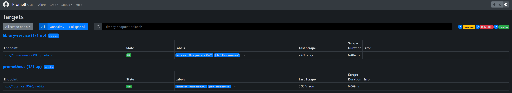

---

## 8. Difficultés rencontrées et solutions

### 8.1 Tests unitaires en CI sans base de données

**Problème :** Les tests unitaires échouaient dans GitHub Actions avec l'erreur `Dialect needs to be explicitly supplied`. Sequelize tentait de se connecter même pour des tests avec des mocks.

**Solution :** Ajout de variables d'environnement fallback dans `vitest.config.ts` :
```typescript
env: {
  DB_DIALECT: 'postgres',
  DB_NAME: 'test_db',
  DB_USER: 'test',
  DB_PASS: 'test',
  DB_HOST: 'localhost',
  DB_PORT: '5432',
}
```
Cela permet à Sequelize de s'initialiser sans erreur, même si aucune connexion réelle n'est établie pendant les tests unitaires.

### 8.2 Endpoints de monitoring inaccessibles

**Problème :** Le HEALTHCHECK Docker et les probes Kubernetes ne trouvaient pas `/health` (404). Les routes de monitoring étaient montées sur `/api/v1/health`.

**Solution :** Modification du montage des routes dans `app.ts` :
```typescript
// Avant : app.use('/api/v1', monitoringRoutes)  → /api/v1/health
// Après : app.use('/', monitoringRoutes)         → /health
```
Les routes métier restent sous `/api/v1` tandis que les endpoints d'observabilité sont à la racine, conformément aux conventions Kubernetes et Docker.

### 8.3 CodeQL v3 dépréciée

**Problème :** Le pipeline CI échouait car les actions `github/codeql-action/*@v3` étaient obsolètes.

**Solution :** Mise à jour des trois occurrences vers `@v4` (init, analyze, upload-sarif) et ajout de la permission `security-events: write` sur le job build pour l'upload SARIF de Trivy.

### 8.4 Timing des healthchecks Docker

**Problème :** Le conteneur `library-service` était marqué `unhealthy` avant d'avoir eu le temps de démarrer. La base PostgreSQL prend quelques secondes à se synchroniser avec Sequelize (`sync({ alter: true })`).

**Solution :** Augmentation du `start_period` de 20s à 40s et du nombre de `retries` de 3 à 5 dans `docker-compose.yml`. Ces valeurs laissent suffisamment de temps pour l'initialisation de la base et le seeding du compte admin.

### 8.5 Image Docker non trouvée dans Minikube

**Problème :** Les pods Kubernetes restaient en `ImagePullBackOff` car l'image `ghcr.io/.../latest` n'était pas disponible dans le registre de Minikube.

**Solution :** Construction de l'image directement dans le contexte Docker de Minikube via `minikube docker-env`, puis utilisation de `imagePullPolicy: IfNotPresent` localement. En production, le pipeline CI pousse l'image vers GHCR et les pods la tirent normalement.

### 8.6 Déploiement Kubernetes en CI sans cluster externe

**Problème :** Le job de déploiement CI/CD échouait avec « Input required and not supplied: kubeconfig ». Le cluster Minikube local n'est pas accessible depuis les runners GitHub Actions.

**Solution :** Remplacement du déploiement vers un cluster externe par **kind** (Kubernetes IN Docker). Kind crée un cluster Kubernetes éphémère directement dans le runner CI, charge l'image Docker locale et applique les manifestes — sans aucun secret ni configuration externe.

### 8.7 Alerte CodeQL « Missing rate limiting »

**Problème :** CodeQL identifiait une vulnérabilité de sévérité High « Missing rate limiting » sur les routes d'authentification et de gestion des livres, exposant l'API aux attaques par brute-force.

**Solution :** Ajout du package `express-rate-limit` avec deux configurations distinctes :
- Routes d'authentification : 20 requêtes par fenêtre de 15 minutes
- Routes de l'API livres : 100 requêtes par fenêtre de 15 minutes

---

## 9. Conclusion et perspectives

### 9.1 Bilan

Ce projet a permis de mettre en pratique l'ensemble de la chaîne de valeur d'un microservice en production :

- **Conception** : modélisation UML complète (5 diagrammes) avant l'implémentation
- **Implémentation** : architecture MVC + Repository en TypeScript avec séparation stricte des responsabilités
- **Sécurité** : rate limiting sur les endpoints sensibles, analyse SAST via CodeQL, scan d'images Docker via Trivy
- **Qualité** : 52 tests automatisés (25 unitaires + 27 intégration), couverture > 80%, ESLint + CodeQL
- **Conteneurisation** : image Docker optimisée (multistage, non-root, < 200 Mo)
- **Orchestration** : déploiement Kubernetes complet avec autoscaling, probes, et zero-downtime rollout
- **Monitoring** : stack Prometheus + Grafana auto-provisionnée avec 8 panneaux et 3 règles d'alertes, métriques système via node-exporter
- **Tracing distribué** : OpenTelemetry SDK avec auto-instrumentation et visualisation Jaeger
- **Documentation API** : spécification OpenAPI 3.0.3 interactive via Swagger UI
- **CI/CD** : pipeline GitHub Actions en 5 étapes avec scan de sécurité (CodeQL + Trivy) et déploiement Kubernetes automatisé via kind
- **Performance** : 120 req/s confirmé par k6 avec 0% d'erreur et P95 < 30 ms

### 9.2 Perspectives d'amélioration

**Court terme :**
- **Pagination cursor-based** : remplacer la pagination offset par une pagination par curseur pour de meilleures performances à grande échelle
- **Cache Redis** : mettre en cache les requêtes de consultation du catalogue pour réduire la charge PostgreSQL
- **Alerting** : intégrer Alertmanager avec notification Slack/email pour les alertes Prometheus

**Moyen terme :**
- **Event-driven architecture** : publier des événements (BookBorrowed, BookReturned) via un message broker (RabbitMQ/Kafka) pour découpler les services
- **API Gateway** : ajouter Kong ou Traefik comme point d'entrée unifié avec authentification centralisée
- **Métriques RED** : enrichir les dashboards Grafana avec les métriques Rate/Errors/Duration par endpoint

**Long terme :**
- **Décomposition en microservices** : séparer Auth, Books et Borrows en services indépendants avec chacun sa propre base de données
- **CQRS** : séparer les modèles de lecture et d'écriture pour optimiser les performances selon les cas d'usage
- **Infrastructure as Code** : migrer les manifestes K8s vers Helm charts ou Terraform pour une gestion déclarative de l'infrastructure
